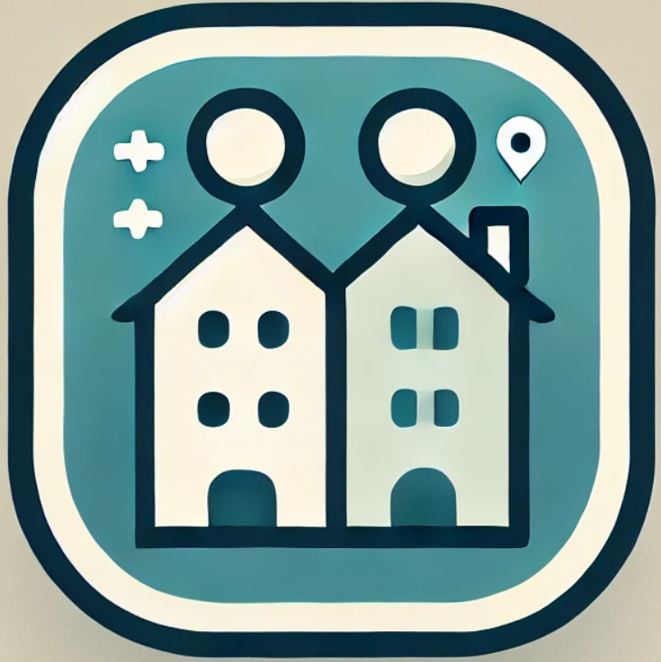

<a id="readme-alku"></a>
<!-- SHIELDIT -->
[![Contributors][contributors-shield]][contributors-url]
[![Issues][issues-shield]][issues-url]

<div align="center">

<h1><i>Kämppis</i></h1>
</div>

<br>
<details>
<summary><b>Sisällysluetto</b></summary>
  <ol>
    <li>
        <a href="#mikä-kämppis">Mikä <i>Kämppis</i>?</a>
    </li>
    <li>
        <a href="#teknologiat">Teknologiat</a>
    </li>
    <li>
        <a href="#asennus">Asennus</a>
    </li>
    <li>
        <a href="#ota-yhteyttä">Ota yhteyttä</a>
    </li>
  </ol>
</details><br>

## Mikä _Kämppis_?
_Kämppis_ on mobiilisovellus, joka yhdistää kämppiksiä etsivät ihmiset toistensa kanssa.

Kaikki projektin appin avoimet issuet sekä tunnetut bugit löydät täältä: <br>
[![App issues][app-issues-logo]][app-issues-url]

Tämä repositorio sisältää projektin mobiilisovelluksen. Back-endin repositorion löydät täältä:<br>
[![Back-end repository][back-end-repository-logo]][back-end-repository-url]

Lisätietoa koko projektista löydät täältä: <br>
[![Project repository][project-repository-logo]][project-repository-url]

Projekti on toteutettu osana Haaga-Helia ammattikorkeakoulun [Ohjelmistoprojekti 2](https://opinto-opas.haaga-helia.fi/course_unit/SOF007AS3A) -opintojaksoa.

<p align="right">(<a href="#readme-alku">Takaisin alkuun</a>)</p>

## Teknologiat

_Kämppiksen_ mobiilisovellus on rakennettu käyttämällä seuraavia teknologioita:

[![TypeScript][typescript-logo]][typescript-url]
[![React Native][react-native-logo]][react-native-url]
[![GitHub][github-logo]][github-url]
[![Docker][docker-logo]][docker-url]
[![Expo Go][expo-logo]][expo-url]
[![Bruno][bruno-logo]][bruno-url]
[![Visual Studio Code][vs-code-logo]][vs-code-url]

<p align="right">(<a href="#readme-alku">Takaisin alkuun</a>)</p>

## Asennus
Asennukseen tarvitset [Dockerin](https://www.docker.com) sekä _Kämppiksen_ [back-end-repositorion](https://github.com/HH-Nat20/kamppis-server).

### Docker setup for developing the front end

1. Install docker

2. Create the image

   ```bash
    docker build -t kamppis-app .
   ```

3. Run the container

   ```bash
   docker run --rm -v ./:/app -itp 19000:19000 -p 19001:19001 -p 19002:19002 -p 8081:8081 kamppis-app
   ```

### If you have the backend repository pulled as well, you can use docker-compose

1. Make sure you have the folders `kamppis-app` including the front-end and `kamppis-server` including the back-end at the same level within your file system.

2. Run docker compose

   ```bash
      docker-compose up --build
   ```

3. To bring the containers down, use

   ```bash
      docker-compose down -v
   ```

### To Build the App for Android, use the following instructions

1. Install eas-cli

   ```bash
      npm install -g eas-cli
   ```
   
2. Make sure you have expo installed as well

   ```bash
      npm install -g expo-cli
   ```

3. Login with your expo credentials (if you haven't registered, do so in https://expo.dev/signup)

   ```bash
      expo Login
   ```
   
4. Build the app using eas-cli and wait for the proccess to finish.

   ```bash
      eas build --platform android --profile preview
   ```
   <p align="right">(<a href="#readme-alku">Takaisin alkuun</a>)</p>

## Ota yhteyttä
Sovelluksen ovat toteuttaneet
- Janne Airaksinen: [devaajanne](https://github.com/devaajanne)
- Paul Carlson: [Phoolis](https://github.com/Phoolis)
- Jesse Hellman: [Bminor87](https://github.com/Bminor87)
- Julia Hämäläinen: [marttyyriroskis](https://github.com/marttyyriroskis)

Kehittäjien yhteystiedot löydät GitHub-profiileista.
<p align="right">(<a href="#readme-alku">Takaisin alkuun</a>)</p>

<!-- LINKIT JA KUVAT -->

<!-- CONTRIBUTORS JA ISSUES -->
[contributors-shield]: https://img.shields.io/github/contributors/HH-Nat20/kamppis-app?style=for-the-badge
[contributors-url]: https://img.shields.io/github/contributors/HH-Nat20/kamppis-app
[issues-shield]: https://img.shields.io/github/issues/HH-Nat20/kamppis-app?style=for-the-badge
[issues-url]: https://img.shields.io/github/issues/HH-Nat20/kamppis-app

<!-- PROJEKTI JA REPOSITORIOT -->
[back-end-repository-logo]: https://img.shields.io/badge/BackEnd%20Repository-000000?style=for-the-badge
[back-end-repository-url]: https://github.com/HH-Nat20/kamppis-server
[project-repository-logo]: https://img.shields.io/badge/Project%20Repository-000000?style=for-the-badge
[project-repository-url]: https://github.com/HH-Nat20
[app-issues-logo]: https://img.shields.io/badge/App%20Open%20Issues%20And%20Bugs-000000?style=for-the-badge
[app-issues-url]: https://github.com/HH-Nat20/kamppis-app/issues

<!-- TEKNOLOGIAT JA TYÖKALUT-->
[typescript-logo]: https://img.shields.io/badge/TypeScript-3178C6?style=for-the-badge&logo=typescript&logoColor=white
[typescript-url]: https://www.typescriptlang.org/
[react-native-logo]: https://img.shields.io/badge/react_native-%2320232a.svg?style=for-the-badge&logo=react&logoColor=%2361DAFB
[react-native-url]: https://reactnative.dev/
[github-logo]: https://img.shields.io/badge/GitHub-%23121011.svg?logo=github&logoColor=white&style=for-the-badge
[github-url]: https://github.com/
[docker-logo]: https://img.shields.io/badge/docker-257bd6?style=for-the-badge&logo=docker&logoColor=white
[docker-url]: https://www.docker.com/
[expo-logo]: https://img.shields.io/badge/Expo-000020?style=for-the-badge&logo=expo&logoColor=fff
[expo-url]: https://expo.dev/go
[bruno-logo]: https://img.shields.io/badge/Bruno-FF6C37?style=for-the-badge&logo=Bruno&logoColor=white
[bruno-url]: https://www.usebruno.com/
[vs-code-logo]: https://custom-icon-badges.demolab.com/badge/Visual%20Studio%20Code-0078d7.svg?logo=vsc&logoColor=white&style=for-the-badge
[vs-code-url]: https://code.visualstudio.com/